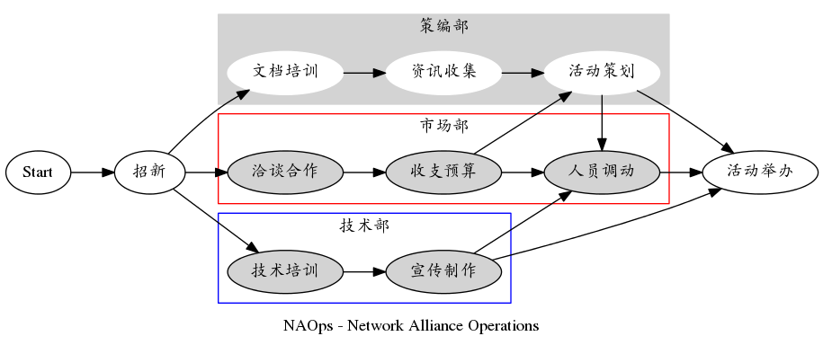
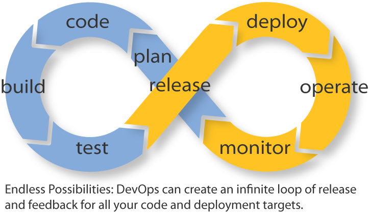

.. include:: <s5defs.txt>

.. _gh-pages: http://jnuren12.github.io/docs/20150817-pre-long-ver/
.. _Anqurvanillapy: http://anqurvanillapy.github.io/
.. _Zoom.Quiet: http://zoomquiet.io/
.. _GitHub: https://github.com/jnuren12/docs/tree/master/pages/20150817-pre-long-ver

===========
你好, 网联!
===========

(powered by rst2s5)
-------------------

:Author: AnqurVanillapy_
:URL: gh-pages_

.. footer::

    .. image:: https://i.creativecommons.org/l/by-nc-sa/4.0/80x15.png
        :target: http://creativecommons.org/licenses/by-nc-sa/4.0/

高桥流!
=======

.. image:: img/Takahashi-method.jpg
    :scale: 150%
    :alt: Takahashi-method
    :align: center
    :target: https://en.wikipedia.org/wiki/Takahashi_method

.. class:: handout

    幻灯片风格沿用 Takahashi method，
    由纯文本编辑环境进行编写设计

Why not PPT?
============

.. class:: incremental

    * 纯文字编写, `思路` 与 `设计` 并行
    * 渲染简单, 几乎没有 `兼容` 问题
    * 输出 `网页`, 可以定制 `主题`
    * 专注文字, `少即是多!`

暨南人网络联盟
==============

.. class:: center huge orange

    *JNURen Network Alliance*

暨南人
======

.. class:: center huge

    JNU :orange:`Ren`

.. class:: center

    *时刻关注, 暨南学子*

网络
====

.. class:: center huge

    :orange:`Network`

.. class:: center

    *拥抱网络, 分享技术*

联盟
====

.. class:: center huge

    :orange:`Alliance`

.. class:: center

    *联系你我, 集思广益*

上上一届
========

.. class:: center huge

    :orange:`Confederation`: *united*

上一届
======

.. class:: center huge

    :orange:`League`: *purpose*

Now,
====

.. class:: center huge

    :orange:`Alliance`: *mutual benefits*

<NAOps/>
========

.. class:: center huge

    网联的 :orange:`工作流`

招新!
=====

.. class:: incremental huge

    * 4
    * 7
    * 35+

<初期流程>
==========

.. class:: incremental huge

    * 技术培训
    * 制度培训
    * 线上活动

<策编部/>
=========

.. class:: incremental huge

    * 活动策划
    * 资讯收集
    * 文件编辑

<市场部/>
=========

.. class:: incremental huge

    * 收支预算
    * 洽谈合作
    * 人员调动

<技术部/>
=========

`主要进行技术投资, 包括`

.. class:: incremental big

    * 媒宣组
    * 产品组
    * 开发组

</初期流程>
===========

<后期流程>
==========

.. class:: center huge

    | 啊, 也许可以开始折腾一些
    | :orange:`技术组` 联系更紧密的流程了

瀑布式?
=======

.. class:: center huge

    :orange:`开发` -> :orange:`测试` -> :orange:`发布`

DevOps?
=======

不不不,
=======

.. class:: center huge

    | 当然没那么高端 :orange:`:)`
    | 更适应网联的 :orange:`工作流`

<NAOps/>
========

.. class:: center huge

    :orange:`FLOSS` <=> :orange:`APP`

<FLOSS/>
========

`自由/开源软件`

.. class:: incremental

    * 实用便捷的工具
    * 供学习与测试的脚本
    * 非个人的开发框架

<APP/>
======

.. class:: incremental huge

    * native/hybrid app
    * web app

举个栗子
========

.. class:: incremental huge

    * 买卖网站
    * 论坛应用
    * 网页游戏

简要追述
========

.. class:: incremental

    * 产品部: `产品调研,` `产品设计`
    * 市场部: `市场调研,` `公关合作`
    * 开发部: `产品迭代,` `测试发布`
    * 媒宣部: `产品宣传,` `包装传播`
    * 策编部: `结合线下,` `协助维护`

</后期流程>
============

.. image:: img/late-ops.png
    :scale: 75%
    :alt: late-ops
    :align: center

当然
====

.. class:: huge

    `外包项目,` `这个可以有!`

折腾, 真折腾
============

.. class:: center huge

    `问题是...`

Why?
====

.. class:: center huge

    为什么得 :orange:`网联`?

人家说了
========

.. class:: center huge

    噢, :orange:`大学生`

<问题/>
=======

.. class:: center huge

    :orange:`不` 靠谱呐!

靠谱
====

.. class:: center huge

    什么是, :orange:`Kaopu` lity?

Kaopulity
=========

.. class:: incremental big

    * :orange:`K` eep
    * :orange:`A` ll
    * :orange:`O` f
    * :orange:`P` rocesses
    * :orange:`U` sable

A Gap Between
=============

.. class:: center huge

    | `消费者` <=> `销售者`
    | `大学`

更多人的需要
============

.. class:: incremental huge

    * 经验
    * 心态
    * 视野

可是
====

.. class:: incremental huge

    * 没有导师
    * 缺乏自制
    * 缺乏信心

不妨
====

是的, :orange:`网联`!

.. class:: incremental

    * 轻松的集体
    * 真诚的服务
    * 新鲜的分享
    * 共同的进步

最后
====

.. class:: incremental huge

    * 必然的颠覆
    * 自己改变自己
    * 一起折腾, 一起靠谱

关于
====

所受影响

.. class:: incremental

    * CPyUG 创始人 Zoom.Quiet_ 靠谱/Kaopulity 理念
    * 蟒营/PythoniCamp 工程的感化

使用工具
========

.. class:: incremental

    * 遵循 s5 网页幻灯片标准
    * 使用 python-docutils 模块 rst2s5 工具输出幻灯片
    * 使用 Git 本地管理版本
    * 发布至 `GitHub`_ 进行托管, gh-pages  服务渲染网页

LICENSE
=======

.. class:: incremental big

    * 使用 CC BY-NC-SA 4.0 许可
    * `署名` `非商用` `相同方式分享`
    * 是的, 左下角可爱的标志!
