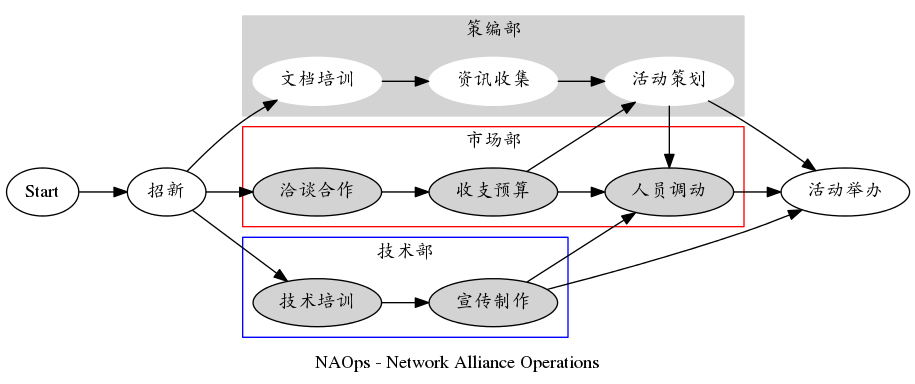
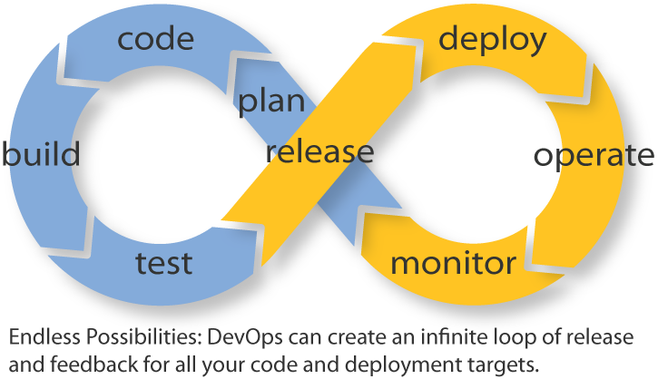

.. include:: <s5defs.txt>

===========
你好, 网联!
===========

(powered by rst2s5)
-------------------

:Author: JNURen Network Alliance XII
:Date: 2015-08-16

.. footer::

    .. image:: https://i.creativecommons.org/l/by-nc-sa/4.0/80x15.png
        :target: http://creativecommons.org/licenses/by-nc-sa/4.0/

高桥流!
=======

.. image:: img/Takahashi-method.jpg
    :scale: 150%
    :alt: Takahashi-method
    :align: center
    :target: https://en.wikipedia.org/wiki/Takahashi_method

.. class:: handout

    幻灯片风格沿用 Takahashi method，
    由纯文本编辑环境进行编写设计

Why not PPT?
============

.. class:: incremental

    * 纯文字编写, `思路` 与 `设计` 并行
    * 渲染简单, 几乎没有 `兼容` 问题
    * 输出 `网页`, 可以定制 `主题`
    * 专注文字, `少即是多!`

暨南人网络联盟
==============

.. class:: center huge orange

    *JNURen Network Alliance*

暨南人
======

.. class:: center huge

    JNU :orange:`Ren`

.. class:: center

    *时刻关注, 暨南学子*

网络
====

.. class:: center huge

    :orange:`Network`

.. class:: center

    *拥抱网络, 分享技术*

联盟
====

.. class:: center huge

    :orange:`Alliance`

.. class:: center

    *联系你我, 集思广益*

上上一届
========

.. class:: center huge

    :orange:`Confederation`: *united*

上一届
======

.. class:: center huge

    :orange:`League`: *purpose*

Now,
====

.. class:: center huge

    :orange:`Alliance`: *mutual benefits*

<NAOps/>
========

.. class:: center huge

    网联的 :orange:`工作流`

招新!
=====

.. class:: incremental huge

    * 4
    * 7
    * 35+

<初期流程>
==========

.. class:: incremental huge

    * 技术培训
    * 制度培训
    * 线上活动

<策编部/>
=========

.. class:: incremental huge

    * 活动策划
    * 资讯收集
    * 文件编辑

<市场部/>
=========

.. class:: incremental huge

    * 收支预算
    * 洽谈合作
    * 人员调动

<技术部/>
=========

`主要进行技术投资, 包括`

.. class:: incremental big

    * 媒宣组
    * 产品组
    * 开发组

</初期流程>
===========

<后期流程>
==========

.. class:: center huge

    | 啊, 也许可以开始折腾一些
    | :orange:`技术组` 联系更紧密的流程了

瀑布式?
=======

.. class:: center huge

    :orange:`开发` -> :orange:`测试` -> :orange:`发布`

DevOps?
=======

不不不,
=======

.. class:: center huge

    | 我们当然需要,
    | :orange:`自己的` 工作流

<NAOps/>
========

